# 笔记2
## 1. 常用函数
```python
# 若a>b，返回a对应位置的元素，否则返回b对应位置的元素
tf.where(tf.greater(a,b), a, b)

# 范围指定维数的随机矩阵
np.random.RandomState().rand(n1, n2, ...)

# 将两个数组按垂直方向叠加
np.vstack((array1, array2))

# 生成指定步长的矩阵
x, y = np.mgrid [1:3:1, 2:4:0.5]
# 将变量变为一维数组
x = x.ravel()
y = y.ravel() 
# 间隔数值点配对 
grid = np.c_[x, y]
```

## 2. 神经网络复杂度与学习率
NN复杂度多用NN层数和NN参数的个数表示
+ 空间复杂度：层数、参数个数
+ 时间复杂度：乘加运算次数

学习率：  
可以先用较大的学习率，快速得到较优解，然后逐步减小学习率，使模型在训练后期稳定。  
指数衰减学习率 = 初始学习率 * 学习率衰减率<sup>(当前轮数/多少轮衰减一次)<sup>  
`learning_rate = lr_base * decay_rate ** (epoch / lr_step)`

## 3. 激活函数
优秀的激活函数：非线性、可微性、单调性、近似恒等性

1. Sigmoid 
    $$ f(x) = \frac{1}{1 + e^{-x}} $$
    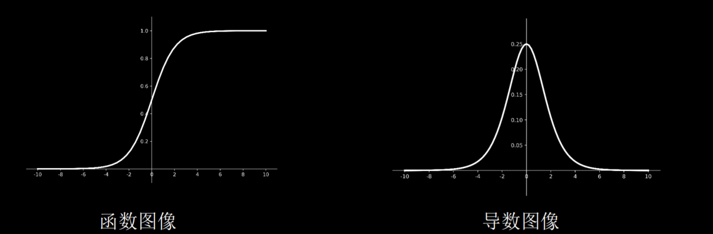
    `tf.nn.sigmoid(x)`
    + 易造成梯度消失
    + 输出非0均值，收敛慢
    + 幂运算复杂，训练时间长
2. Tanh  
    $$ f(x) = \frac{1 - e^{-2x}}{1 + e^{-2x}} $$
    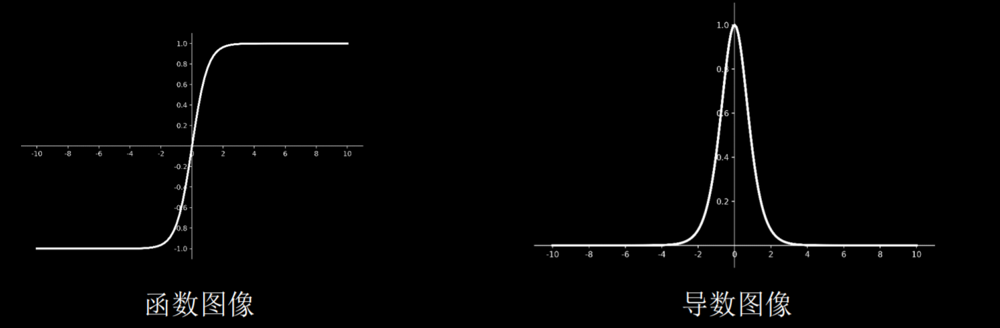
    `tf.math.tanh(x)`
    + 输出是0均值
    + 易造成梯度消失
    + 幂运算复杂，训练时间长
3. Relu  
    $$
    \begin{aligned}
    f(x) &= max(x, 0) \\
         &= \left\{
            \begin{aligned}
            0 \qquad x < 0 \\
            x \qquad x >= 0
            \end{aligned}
            \right.
    \end{aligned}
    $$
    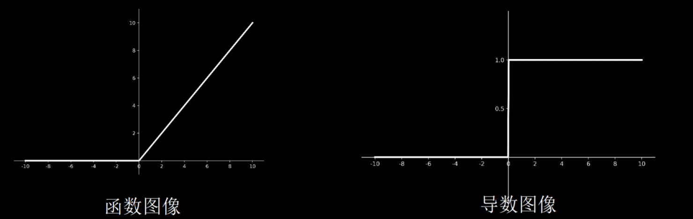
    `tf.nn.relu(x)`
    + 优点
        + 解决了梯度消失问题 (在正区间)
        + 只需判断输入是否大于0，计算速度快
        + 收敛速度远快于sigmoid和tanh
    + 缺点
        + 输出非0均值，收敛慢
        + Dead RelU问题：某些神经元可能永远不会被激活，导致相应的参数永远不能被更新。
4. LeakyRelu  
   $$ f(x) = max(ax, x) $$
   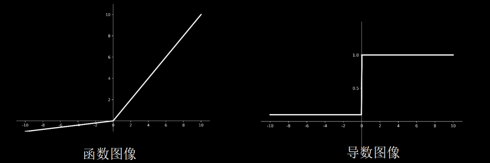
    `tf.nn.leaky_relu(x)`  
    理论上来讲，Leaky Relu有Relu的所有优点，外加不会有Dead Relu问题，但是在实际操作当中，并没有完全证明Leaky Relu总是好于Relu。  

**激活函数选择的建议：**
+ 首选relu激活函数；
+ 学习率设置较小值；
+ 输入特征标准化，即让输入特征满足以0为均值，1为标准差的正态分布；
+ 初始参数中心化，即让随机生成的参数满足以0为均值，$\sqrt{\frac{2}{当前层输入特征个数}}$为标准差的正态分布

## 4. 损失函数
NN优化目标： loss最小 (**预测值yhat与已知答案y的差距**)  

1. 均方误差 Mean Square Error  
   $$ MSE(\hat{y}, y) = {\frac{ \sum_{i=1}^{n}{ ({y - \hat{y})^{2} }}}{n}} $$
   `loss_mse = tf.reduce_mean(tf.square(yhat - y))`  

2. 自定义损失函数
   $$ loss(\hat{y}, y) = \sum_{n}{f(y, \hat{y})} $$  

3. 交叉熵 Cross Entropy  
   $$ H(\hat{y}, y) = -\sum{(y * ln{\hat{y}})} $$
   `tf.losses.categorical_crossentropy(yhat，y)`

    softmax与cross entropy结合：  
    `tf.nn.softmax_cross_entropy_with_logits(y，yhat)` 


## 5. 欠拟合与过拟合
1. 欠拟合的解决方法：  
   + 增加输入特征项
   + 增加网络参数
   + 减少正则化参数
2. 过拟合的解决方法：
    + 数据清洗
    + 增大训练集
    + 采用正则化
    + 增大正则化参数
3. 正则化：
    正则化在损失函数中引入模型复杂度指标，利用给W加权值，弱化了训练数据的噪声（一般不正则化b）  
    `loss = loss(y与y_) + REGULARIZER * `$loss_{L_n}$`(w)`

   1. L1 正则化：
    $$ loss_{L1}(w) = \sum_{i}{|w_i|} $$
   2. L2 正则化：
    $$ loss_{L2}(w) = \sum_{i}{|{w_{i}}^{2}|} $$

    L1正则化大概率会使很多参数变为零，因此该方法可通过稀疏参数，即减少参数的数量，降低复杂度。
    L2正则化会使参数很接近零但不为零，因此该方法可通过减小参数值的大小降低复杂度。

## 6. 优化器
优化器基本步骤：
   + 计算t时刻损失函数关于当前参数的梯度$g_t=\nabla{loss}=\frac{\partial loss}{\partial w_t}$
   + 计算t时刻一阶动量$m_t$和二阶动量$V_t$
   + 计算t时刻下降梯度: $\eta_t=lr*m_t/\sqrt{V_t}$
   + 计算t+1时刻参数: $w_{t+1}=w_t-\eta_t=w_t-lr*m_t/\sqrt{V_t}$

    一阶动量：与梯度相关的函数  
    二阶动量：与梯度平方相关的函数

1. SGD 无momentum随机梯度下降
   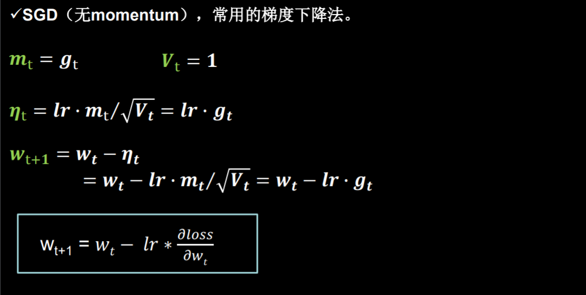
   `w1.assign_sub(lr * grads[0])`
2. SGDM 含momentum的随机梯度下降，SGD基础上增加一阶动量
    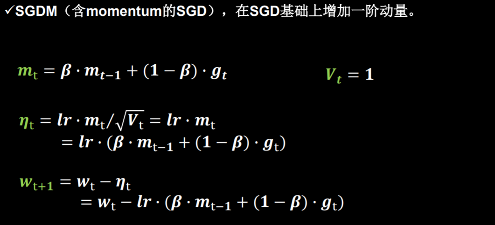
    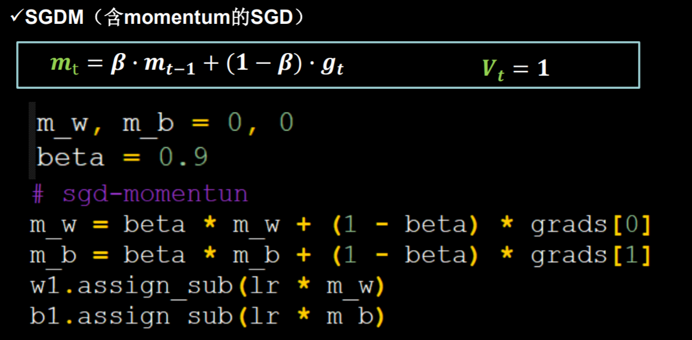
3. Adagrad SGD基础上增加二阶动量
   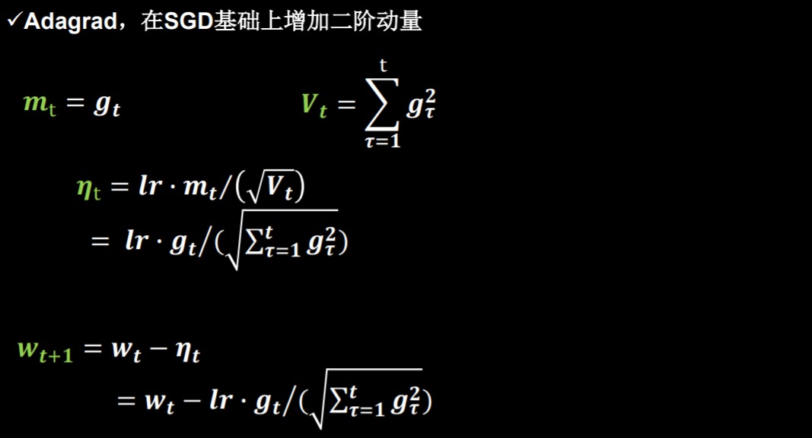
   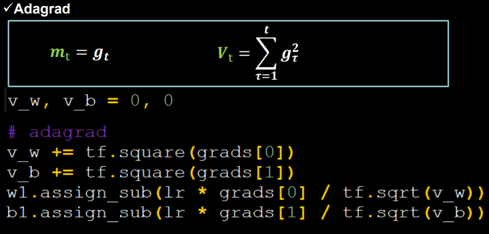
4. RMSProp SGD基础上增加二阶动量
   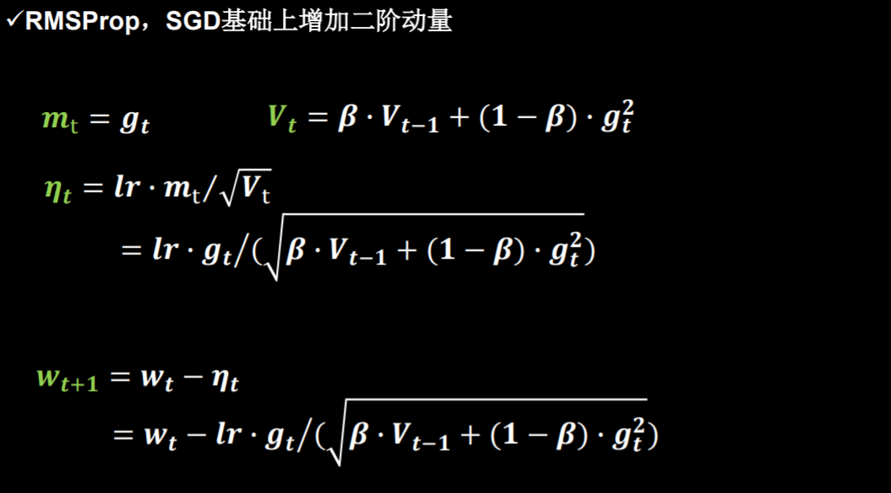
   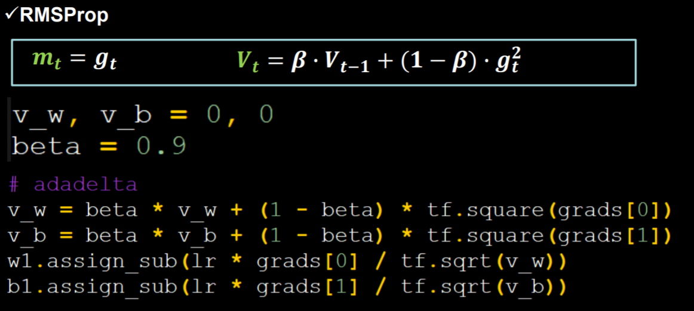
5. Adam 同时结合SGDM一阶动量和RMSProp二阶动量
   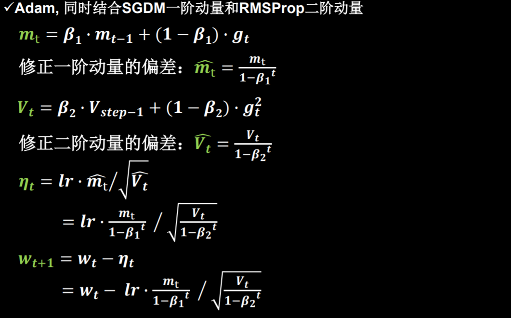
   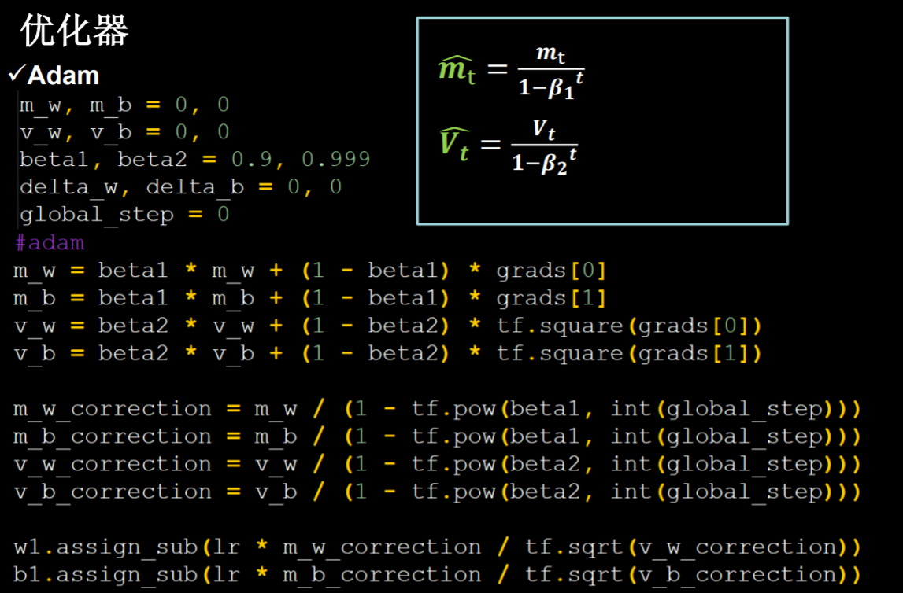
   