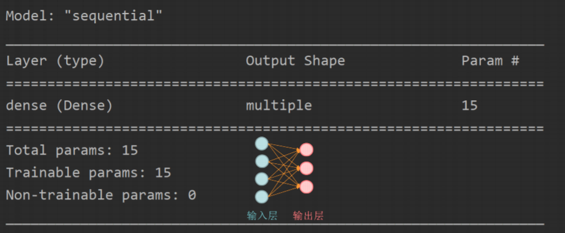
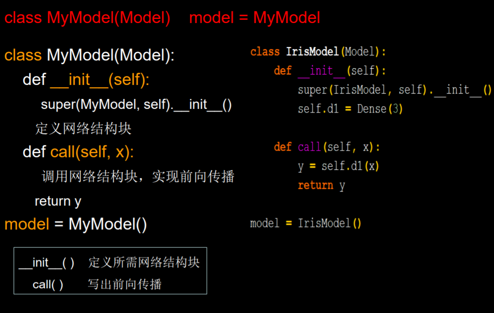

# 笔记3
## 1. Keras 搭建网络八股
    1. import
    2. load_data()
    3. model = tf.keras.models.Sequential
    4. model.compile
    5. model.fit
    6. model.summary

## 2. tf.keras.models/Sequential([...])网络结构举例
+ 拉直层：  
    `tf.keras.layers.Faltten()`
+ 全连接层:   
  `tf.keras.layers.Dense(num_neros, activation, kernel_regularizer)`
  + activation: 字符串给出，如'relu', 'softmax, 'sigmoid', 'tanh'
  + kernel_regularizer: 可选 tf.keras.regularizers.l1(), tf.keras.regularizers.l2()
+ 卷积层:  
  `tf.keras.layers.Conv2D(num_filters, kernel_size, strides, padding='valid' or 'same')`
+ LSTM层:  
  `tf.keras.layers.LSTM()`

## 3. model.compile(optimizer, loss, metrics=['...'])
+ optimizer: 
  + 'sgd' or `tf.keras.optimizers.SGD(lr, momentum)`
  + 'adagrad' or `tf.keras.optimizers.Adagrad(lr)`
  + 'adadelta' or `tf.keras.optimizers.Adadelta(lr)`
  + 'adam' or `tf.keras.optimizers.Adam(lr, beta_1, beta_2)`
+ loss:
  + 'mse' or `tf.keras.losses.MeanSquaredError()`
  + 'sparse_categorical_crossentropy' or `tf.keras.losses.SparseCategoricalCrossentropy(from_logits=Boolean)`
+ metrics:
  + 'accuracy': y和yhat都是数值
  + 'categorical_accuracy': y和yhat都是独热码(概率分布)
  + 'sparse_categorical_accuracy': y是数值, yhat是独热

## 4. model.fit() 
+ x_train
+ y_train
+ batch_size
+ epochs
+ validation_data=(x_test, y_test)
+ validation_split=从训练集划分多少比例给测试集(e.g 0.2)
+ validation_freq=多少次epoch测试一次

## 5. model.summary()


## 6. Model Class


## 7. Mnist数据集
```
mnist = tf.keras.datasets.mnist
(x_train, y_train) , (x_test, y_test) = mnist.load_data()
```
提供 6万张 28*28 像素点的0~9手写数字图片和标签，用于训练。  
提供 1万张 28*28 像素点的0~9手写数字图片和标签，用于测试。

## 8. Fashion数据集
```
fashion = tf.keras.datasets.fashion_mnist
(x_train, y_train),(x_test, y_test) = fashion.load_data()
```
提供 6万张 28*28 像素点的衣裤等图片和标签，用于训练。  
提供 1万张 28*28 像素点的衣裤等图片和标签，用于测试。

  