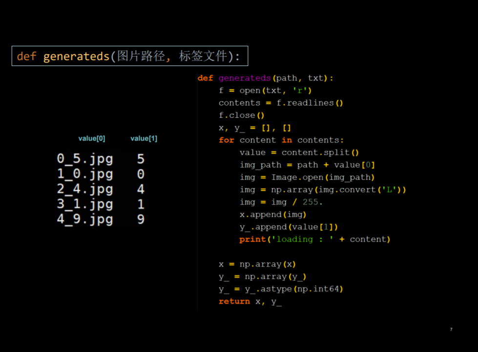
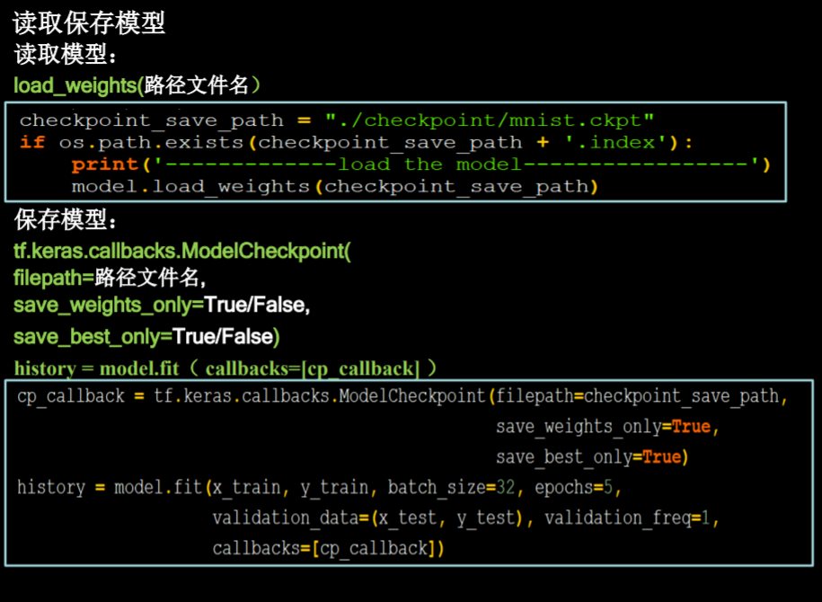
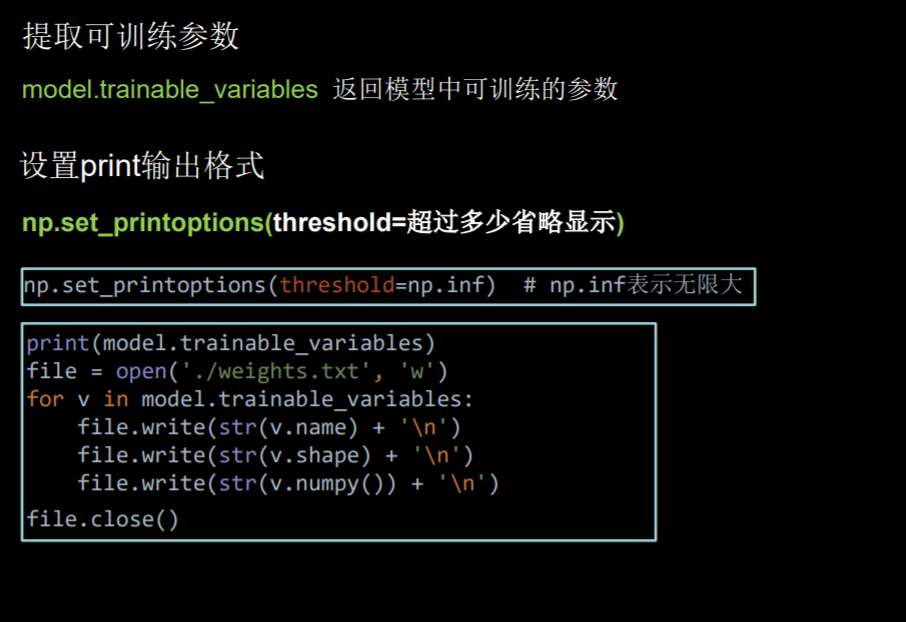
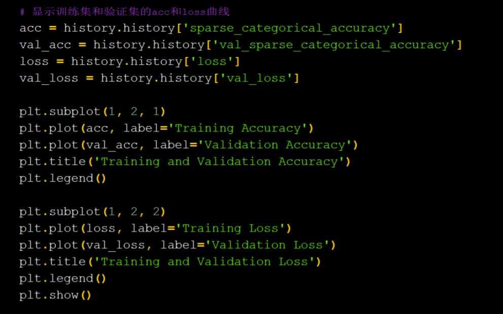

# 笔记04
## 1. 自制数据集

## 2. 数据增强
```
image_gen_train=tf.keras.preprocessing.image.ImageDataGenerator(
rescale = 所有数据将乘以该数值
rotation_range = 随机旋转角度数范围
width_shift_range = 随机宽度偏移量
height_shift_range = 随机高度偏移量
水平翻转：horizontal_flip = 是否随机水平翻转
随机缩放：zoom_range = 随机缩放的范围 [1-n，1+n] )

image_gen_train.fit(x_train)
```
## 3. 断点续训  


## 4. 参数提取

## 5. acc/loss 可视化
```
history=model.fit(x_train, y_train, batch_size, epochs)
```
history:  
+ 训练集loss：loss
+ 测试集loss：val_loss
+ 训练集准确率：sparse_categorical_accuracy
+ 测试集准确率：val_sparse_categorical_accuracy



## 6.Predict
    result = model.predict(x_predict)